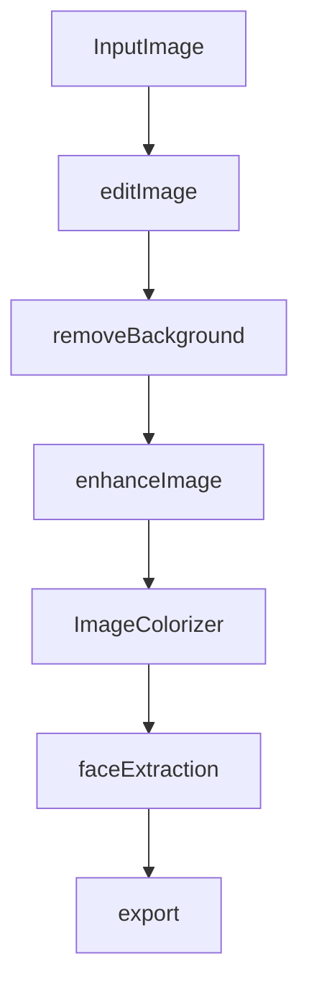

# ClarityKit-Comprehensive-Image-Enhancement

ClarityKit is an image preprocessing suite designed for enhancing, refining, and transforming photos with ease. Featuring tools for angle correction, cropping, background removal, noise reduction, quality improvement, and colour enhancement, ClarityKit empowers creatives to elevate their images to professional standards efficiently.

## Features

This package provides a wide range of precisely designed features aimed at significantly improving image preprocessing. The comprehensive package includes the following:

- Image angle correction
- Image cropping
- Flip the Image Horizontally and Vertically
- Image Magnification
- Background removal
- Image noise reduction
- Image quality enhancement
- Image colouring
- Multi-Format Support

## ClarityKit Workflow

